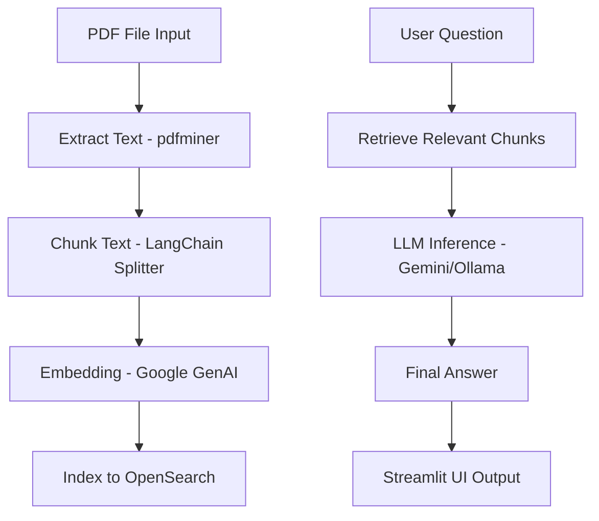

# 🤖 Chatbot FAQ Dokumen PDF dengan LangChain + OpenSearch + Gemini/Ollama

Proyek ini adalah implementasi **chatbot cerdas** berbasis **Retrieval-Augmented Generation (RAG)** yang mampu menjawab pertanyaan pengguna dari dokumen PDF, menggunakan model bahasa besar (LLM) seperti **Gemini** dari Google atau **DeepSeek** melalui **Ollama**. Vector embedding dokumen disimpan dan diambil menggunakan **OpenSearch** sebagai vector store.

---

## 📚 Deskripsi Singkat

> Aplikasi ini bertujuan membantu pengguna mengekstrak informasi dari dokumen PDF tanpa harus membacanya satu per satu. Pengguna hanya tinggal mengetik pertanyaan, dan sistem akan memberikan jawaban yang relevan serta sumber dokumennya.

---

## 🧠 Metodologi: Retrieval-Augmented Generation (RAG)

Proses kerja utama mengikuti pendekatan RAG sebagai berikut:

1. **Ingest Document**  
   PDF dibaca dan teks diekstrak → kemudian di-*chunking* menjadi potongan kecil.
2. **Vector Embedding**  
   Setiap potongan teks dikonversi menjadi vektor menggunakan `GoogleGenerativeAIEmbeddings`.
3. **Indexing**  
   Vektor disimpan ke dalam **OpenSearch** sebagai basis pencarian semantic.
4. **Question Answering**  
   Saat user bertanya:
   - Sistem mengambil dokumen relevan dari OpenSearch.
   - Dokumen dikirim ke LLM (Gemini atau DeepSeek via Ollama).
   - LLM menghasilkan jawaban berdasarkan konteks.

---

## 🧱 Arsitektur Aplikasi (Mermaid Diagram)



---

## 🧰 Stack Teknologi

| Komponen                   | Fungsi Utama                                                                 |
|---------------------------|------------------------------------------------------------------------------|
| **Streamlit**             | Frontend sederhana untuk interaksi pengguna                                 |
| **LangChain**             | Kerangka kerja RAG dan integrasi LLM                                        |
| **LangChain Community**   | Modul komunitas untuk Ollama dan OpenSearch                                 |
| **LangChain Google GenAI**| Embedding & LLM Gemini (Google Generative AI)                               |
| **Ollama**                | Menyediakan LLM lokal seperti DeepSeek                                      |
| **OpenSearch**            | Vector store dan semantic retriever                                         |
| **pdfminer.six**          | Ekstraksi teks dari file PDF                                                |
| **tiktoken**              | Tokenizer untuk estimasi panjang konteks                                    |
| **python-dotenv**         | Mengelola variabel lingkungan (.env)                                        |

---

## 🗃️ Struktur Proyek

```
chatbot_faq/
├── app.py               # Aplikasi utama (Streamlit)
├── utils.py             # Fungsi bantu: ekstraksi, chunking, vectorstore
├── config.py            # Pengaturan API key dan koneksi
├── requirements.txt     # Dependensi Python
├── Dockerfile           # Docker image aplikasi
├── docker-compose.yml   # Orkestrasi multi-kontainer
├── data/                # Folder input PDF
├── README.md            # Dokumentasi proyek
```

---

## 🚀 Cara Menjalankan Aplikasi

### 1. Siapkan Dokumen PDF

Letakkan file PDF di dalam folder `data/`

### 2. Jalankan dengan Docker

```bash
docker-compose up --build
```

Akses aplikasi di browser:

```
http://localhost:8503
```

---

## 🔐 Contoh `.env`

```env
GOOGLE_API_KEY=your_google_api_key
OLLAMA_BASE_URL=http://10.100.21.22:11434
OLLAMA_MODEL_NAME=deepseek-r1:8b
OPENSEARCH_URL=http://opensearch-node:9200
OPENSEARCH_INDEX=chatbot_faq_index
```

---

## 📖 Referensi dan Bacaan Lanjut

| Topik                            | Referensi                                                                 |
|----------------------------------|---------------------------------------------------------------------------|
| LangChain RAG                    | https://docs.langchain.com/docs/use-cases/question-answering             |
| LangChain + Google GenAI        | https://python.langchain.com/docs/integrations/llms/google_genai         |
| OpenSearch Vector Search         | https://opensearch.org/docs/latest/search-plugins/knn/                    |
| Ollama dan DeepSeek              | https://ollama.com/library/deepseek-r1                                    |
| Gemini API Google AI             | https://ai.google.dev/                                                   |
| Streamlit                        | https://docs.streamlit.io/                                               |
| pdfminer.six                     | https://pdfminersix.readthedocs.io/                                      |

---

## 👨‍💻 Kontributor

- **Hendri Karisma**  
  Head of Data & AI – [Jejakin](https://jejakin.com/)  
  Spesialisasi: LLM, RAG, Vector DB, Fraud AI, DevOps

---

## 🧩 Rencana Pengembangan Lanjutan (Opsional)

- [ ] Tambahkan MongoDB sebagai alternatif vector store
- [ ] Tambahkan fitur upload PDF via UI
- [ ] Integrasi dengan LangChain Agent
- [ ] Logging dan statistik penggunaan
